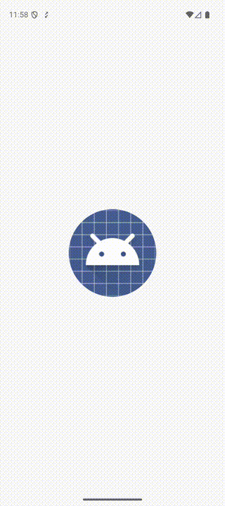

# HelloDistort

A Compose Multiplatform port of the WWDC-style touch distortion effect. Drag across the screen to smear text with velocity-based directional motion blur and chromatic aberration — powered by AGSL shaders.

## Demo

<p align="center">
  
</p>

## Inspiration

Ported from the viral SwiftUI Metal shader by [Daniel Kuntz (@dankuntz)](https://x.com/dankuntz/status/1813283813881225625):

<blockquote>
<a href="https://x.com/dankuntz/status/1813283813881225625">

</a>
</blockquote>

The original uses SwiftUI's `DragGesture` velocity + a Metal `[[stitchable]]` layer effect to create a touch-reactive chromatic smear:

```metal
[[stitchable]]
half4 w(float2 p, SwiftUI::Layer a, float2 l, float2 v) {
    float2 m = -v * pow(clamp(1-length(l-p)/190,0.,1.),2) * 1.5;
    half3 c = 0;
    for (float i = 0; i < 10; i++) {
        float s = .175 + .005*i;
        c += half3(a.sample(p+s*m).r, a.sample(p+(s+.025)*m).g, a.sample(p+(s+.05)*m).b);
    }
    return half4(c/10, 1);
}
```

This project ports that exact shader to AGSL for Compose Multiplatform.

## Architecture

| Layer | File | Role |
|-------|------|------|
| **Common UI** | `App.kt` | Text wallpaper, drag tracking, velocity smoothing |
| **Common Contract** | `DistortionEffect.kt` | `expect/actual` interface for shader effect |
| **Android Shader** | `DistortionShader.android.kt` | AGSL `RuntimeShader` — port of Metal shader |
| **iOS Stub** | `DistortionShader.ios.kt` | No-op (RenderEffect not available in Compose iOS) |

## Tech Stack

- Kotlin Multiplatform + Compose Multiplatform
- AGSL (Android Graphics Shading Language) via `RuntimeShader`
- Exponential velocity smoothing for fluid drag tracking
- Targets: Android (API 26+), iOS (stub)

## Learn

New to AGSL? Read **[What is AGSL?](what-is-agsl.md)** — a full breakdown of this shader explained in Android/Compose terminology, with a Compose ↔ AGSL mapping table.

## Building

```bash
./gradlew :composeApp:assembleDebug
```

## Credits

Original Metal shader by [Daniel Kuntz (@dankuntz)](https://x.com/dankuntz/status/1813283813881225625). AGSL port for Compose Multiplatform.
