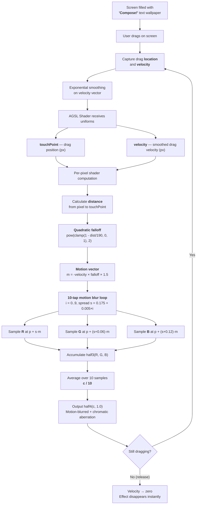
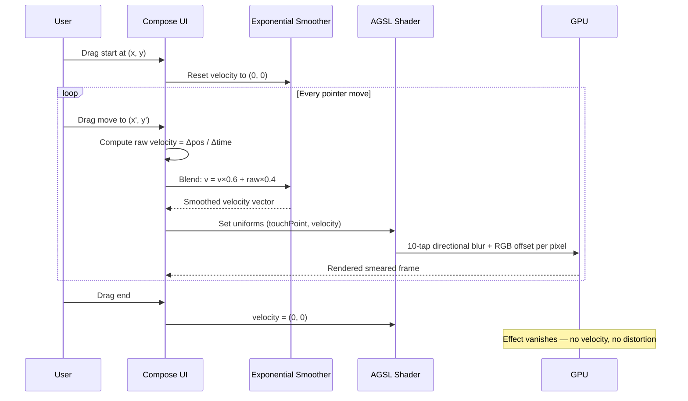

# What is AGSL?

AGSL (Android Graphics Shading Language) lets you write per-pixel GPU programs that plug into Compose via `RenderEffect`. If you know Compose, you already understand AGSL — here's the mapping.

## Your screen is a giant `Canvas`

In Compose you write `Canvas { drawRect(), drawText() }`. Your screen is that canvas — millions of tiny colored dots (pixels). Each pixel is just a `Color(r, g, b, a)`.

## Every pixel runs `main()` — like a tiny `@Composable`

In Compose, `@Composable fun MyBox()` decides what to show. In AGSL, `half4 main(float2 p)` decides **what color one pixel should be**.

The difference? Your `@Composable` runs once for the whole view. The shader's `main()` runs **once per pixel, per frame**. On a 1080×2400 phone at 60fps = **156 million calls per second**. The GPU handles this because it runs thousands in parallel — like having thousands of `LaunchedEffect`s all running at once.

## `uniform` = `remember { mutableStateOf() }`

Compose:
```kotlin
var touchPoint by remember { mutableStateOf(Offset.Zero) }
```

AGSL:
```glsl
uniform float2 touchPoint;
```

Same idea — a value that persists across frames, updated from outside. Compose state triggers recomposition. Uniforms get pushed to the GPU every frame via `setFloatUniform()`.

## `content.eval(p)` = `graphicsLayer { }`'s source pixels

`Modifier.graphicsLayer { }` gives access to the rendered layer. The `content` shader uniform IS that layer. `content.eval(float2(x, y))` asks: *"What color did Compose draw at position (x, y) before my effect?"*

Returns a `half4` — that's `Color(r, g, b, a)` in GPU-speak. `half` = 16-bit float (cheaper than `float`, good enough for colors 0.0–1.0).

## `RenderEffect` = the bridge from Compose to GPU

```kotlin
// 1. Compile AGSL → GPU program (like inflating XML → View)
val shader = RuntimeShader(agslString)

// 2. Push state to GPU (like ViewModel → Composable)
shader.setFloatUniform("touchPoint", x, y)

// 3. Attach to the layer (like Modifier.background but pixel-level)
graphicsLayer {
    renderEffect = RenderEffect
        .createRuntimeShaderEffect(shader, "content")
        .asComposeRenderEffect()
}
```

## The shader logic in Android terms

### Step 1: Distance check — like `pointerInput` hit testing

```glsl
float dist = length(touchPoint - p);
```
> *"How far is this pixel from the finger?"* Same idea as checking if a touch is inside a composable's bounds, but for every pixel individually.

### Step 2: Falloff — like `animateFloatAsState` easing

```glsl
float falloff = pow(clamp(1.0 - dist / 190.0, 0.0, 1.0), 2.0);
```
> `pow(..., 2)` is a quadratic ease-out — same shape as `FastOutSlowInEasing`. Pixels near finger = full effect. Pixels at 190px = zero. Like an `Animatable` spring but spatial instead of temporal.

### Step 3: Motion vector — like `Modifier.offset` but per-pixel

```glsl
float2 m = -velocity * falloff * 1.5;
```
> In Compose: `Modifier.offset { IntOffset(x, y) }` shifts a whole view. Here we compute a different offset for EACH pixel. Near the finger = big shift. Far away = no shift. `-velocity` means shift opposite to drag — like `Modifier.offset` with a negative drag delta.

### Step 4: Multi-sampling — like `LazyColumn` drawing multiple items

```glsl
for (float i = 0.0; i < 10.0; i += 1.0) {
    float s = 0.175 + 0.005 * i;
    c += half3(
        content.eval(p + s * m).r,          // Red eye
        content.eval(p + (s + 0.06) * m).g,  // Green eye
        content.eval(p + (s + 0.12) * m).b   // Blue eye
    );
}
return half4(c / 10.0, 1.0);
```
> Sample 10 nearby positions and average = **motion blur** (like 10 frames of a `LazyColumn` scroll stacked together). R/G/B at different offsets = **chromatic aberration** (like `Color.Red`, `Color.Green`, `Color.Blue` each with a slightly different `Modifier.offset`).

## The full Compose ↔ AGSL mapping

| Compose / Android | AGSL |
|---|---|
| `@Composable fun` | `half4 main(float2 p)` |
| `remember { mutableStateOf() }` | `uniform float/float2` |
| `Color(r, g, b, a)` | `half4(r, g, b, a)` |
| `Offset(x, y)` | `float2(x, y)` |
| `Modifier.graphicsLayer` | `RenderEffect` attachment point |
| `Modifier.offset { }` | `content.eval(p + offset)` |
| `animateFloatAsState` easing | `pow(clamp(...), 2.0)` falloff |
| Recomposition | Runs every frame on GPU automatically |
| `LaunchedEffect` coroutine | GPU parallelism (millions of "coroutines") |

## The pipeline

```
pointerInput → touchPoint/velocity state → setFloatUniform() → GPU shader → screen
```

Same pattern as:

```
pointerInput → ViewModel state → @Composable → UI
```

Just instead of recomposing `Text()`, you're recomputing every pixel through a shader.

> **TL;DR** — *"It's `Modifier.offset` + `Color` channel splitting, but instead of one composable, it applies to every single pixel individually, 156 million times per second, on the GPU."*

## Metal vs AGSL — side by side

The original Metal `[[stitchable]]` shader:
```metal
half4 w(float2 p, SwiftUI::Layer a, float2 l, float2 v) {
    float2 m = -v * pow(clamp(1-length(l-p)/190,0.,1.),2) * 1.5;
    half3 c = 0;
    for (float i = 0; i < 10; i++) {
        float s = .175 + .005*i;
        c += half3(a.sample(p+s*m).r, a.sample(p+(s+.025)*m).g, a.sample(p+(s+.05)*m).b);
    }
    return half4(c/10, 1);
}
```

The AGSL port (with amplified chromatic aberration):
```agsl
half4 main(float2 p) {
    float dist = length(touchPoint - p);
    float falloff = pow(clamp(1.0 - dist / 190.0, 0.0, 1.0), 2.0);
    float2 m = -velocity * falloff * 1.5;

    half3 c = half3(0.0, 0.0, 0.0);
    for (float i = 0.0; i < 10.0; i += 1.0) {
        float s = 0.175 + 0.005 * i;
        c += half3(
            content.eval(p + s * m).r,
            content.eval(p + (s + 0.06) * m).g,
            content.eval(p + (s + 0.12) * m).b
        );
    }
    return half4(c / 10.0, 1.0);
}
```

## How the animation works




